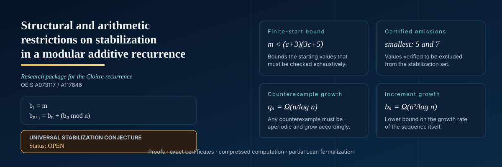

<p align="center">
  
</p>

<p align="center">
  <a href="https://github.com/Kodaxadev/cloitre-recurrence/actions/workflows/ci.yml"></a>
  <a href="LICENSE"></a>
  <a href="https://github.com/Kodaxadev/cloitre-recurrence/tree/v0.1.0-audit"></a>
  
</p>

<p align="center">
  <strong>Proofs · exact certificates · compressed computation · partial Lean formalization</strong>
</p>

---

## The problem

For a positive integer \(m\), define

\[
b_1=m,\qquad b_{n+1}=b_n+(b_n\bmod n).
\]

The **Cloitre stabilization conjecture** asks whether, for every start \(m\), the increments

\[
b_{n+1}-b_n
\]

are eventually constant. The problem appears in [OEIS A073117](https://oeis.org/A073117), [OEIS A117846](https://oeis.org/A117846), and [MathOverflow 191518](https://mathoverflow.net/questions/191518/mod-sequences-that-seem-to-become-constant-and-the-number-316).

> [!IMPORTANT]
> **The universal stabilization conjecture remains open.** This repository contains internally audited partial theorems, certified finite results, and reproducible computational evidence—not a proof of universal stabilization.

## Results at a glance

<table>
<tr>
<td width="50%" valign="top">

### Finite-start theorem

If the orbit from \(m\) has eventual increment \(c\), then

\[
\boxed{m<(c+3)(3c+5)}.
\]

This converts every fixed-increment question into a finite computation.

</td>
<td width="50%" valign="top">

### Certified nonsurjectivity

The eventual increments are **not** surjective onto the positive integers.

The smallest omitted values are

\[
\boxed{5\text{ and }7}.
\]

This is supported by an independent arbitrary-precision certificate covering the complete finite ranges supplied by the theorem.

</td>
</tr>
<tr>
<td width="50%" valign="top">

### Counterexample restrictions

Every bounded-quotient orbit stabilizes. Hence any counterexample must satisfy

\[
q_n\to\infty,
\qquad
q_n=\Omega_m\!\left(\frac{n}{\log n}\right),
\qquad
b_n=\Omega_m\!\left(\frac{n^2}{\log n}\right).
\]

</td>
<td width="50%" valign="top">

### Periodic behavior excluded

No admissible nonzero eventually periodic quotient-change sequence exists.

Therefore any counterexample must be **genuinely aperiodic**.

</td>
</tr>
</table>

## Structural coordinate

Write

\[
b_n=q_n n+r_n,\qquad 0\le r_n<n,\qquad e_n=r_n-q_n.
\]

Then the recurrence becomes

\[
\boxed{e_{n+1}=2e_n-\Delta q_n(n+2)},
\qquad
e_{n+1}\equiv2e_n\pmod{n+2}.
\]

Stabilization is exactly the event \(e_n=0\). This exposes the dynamics as a doubling map with a moving modulus and supplies the main organizing coordinate for the project.

## Claim status

| Claim | Current status | Evidence boundary |
|---|---|---|
| Universal stabilization | **Open** | No proof claimed |
| \(m<(c+3)(3c+5)\) | Internally proved | Complete proof; awaiting external mathematical review |
| Eventual increments 5 and 7 are omitted | Certified | Independent complete finite certificate |
| 106 omissions among \(1,\dots,1823\) | Census result | Primary compressed census; full independent census pending |
| Counterexample growth bounds | Internally proved | Complete proof; awaiting external mathematical review |
| Unit-leading bound with explicit \(1-O(1/\log\log n)\) rate | New internal proof | Theorem 56 and Corollary 57; post-freeze and awaiting fresh audit; optimality for the recurrence is not claimed |
| Sublinear counterexamples have sparse down-steps | New internal proof | Theorem 58 and Corollaries 59/61/64; zero density, divergent spacing, diluted ridge segments, and unbounded zero plateaus, but not finite occurrence |
| Uniform local ridge density is false | New exact construction | Proposition 66 gives valid words \(-1,1^K,0^{K^2},-1\), with up-step fraction \(1/(K+1)\); global reachability and general mixed concatenation remain open |
| Pure unit-terminal ridges cannot repeat indefinitely | New internal proof | Theorem 69 excludes three consecutive \(v=1\) ridges; arbitrary \(v\) requires Theorem 72, while mixed positive words remain open |
| Infinite arbitrary-\(v\) pure tails require exponential local complexity | New internal proof | Theorem 72; conditional on every sufficiently late ridge having word \(1^K0^z\), while mixed positive words remain open |
| Arbitrary mixed ridges reduce to two exact escape modes | New internal proof | Lemmas 73/76/78 and Theorems 75/77: either terminal runs grow, necessarily no faster than \(\log_2\log_2 n+o(1)\), or one fixed dyadic boundary ladder is shadowed infinitely often; neither mode is yet excluded |
| Safe-map wrap blocks are short but quantitatively recurrent | New internal proof | Lemma 80 and Corollaries 81/82 give \(2^kU<n\), \(k\le\log_2\log_2n+o(1)\), and at least \((1-o(1))n/(\log_2n\log_2\log_2n)\) completed positive blocks by a zero epoch; these are restrictions, not termination |
| Adjacent safe-map blocks pass through an exact dyadic gate | New internal proof | Lemma 83 and Corollary 84 give \(m+3-f=2^kA\), a lifted class modulo \(2^{k+1}\), and a sharp interval; the gate either fixes both endpoints uniquely or forces \(2^{k+r+3}<G+r-3\), but neither alternative is excluded |
| Unit-wrap gates have an exact boundary test | New internal proof | Lemmas 85/87, Corollaries 86/88/89, and Theorem 90 give an affine map on \((n,D,s)\), isolate non-short gates, and force every infinite all-unit/all-unique chain onto the exact critical scale \(D_j\sim j\log_2j\) and \(U_j\log_2n_j/n_j\to1\); this is not termination |
| An eventual all-unit, all-unique safe tail is impossible | New internal proof | Theorem 91 turns the critical scale into bounded excess and a six-value dyadic offset; the resulting finite affine-dyadic forms cannot support two starts in one large dyadic epoch, although \(O(\log n)\) index advances force such pairs |
| No eventually periodic quotient-change sequence | Internally proved | Complete proof; awaiting external mathematical review |
| Two-counter termination for every valid entry state | **Open** | Only the eventually-no-down branch is reduced |
| Safe-map instance at \(N=10^6\) | Certified finite result | Independent Rust/Python agreement |
| Safe-map starts at every \(2\le N\le10^6\) | New internal proof from finite certificate | Theorem 46 propagates the checkpoint downward; fresh audit pending |

“Internally proved” means that a complete proof is present and passed a fresh-context internal audit. It does **not** mean that an external specialist has refereed it. See [`audit/release-readiness.md`](audit/release-readiness.md).

## The aperiodic frontier

For an eventually-no-down tail, the project derives an exact future-digit identity and an exact two-counter safe map. A compressed certificate checks all \(999{,}999\) positive states at index \(10^6\) and empties the safe set after \(9{,}019\) additional steps. Theorem 46 shows that this single checkpoint also rules out infinite positive no-down paths beginning at every earlier index.

> [!CAUTION]
> The two-counter map covers the **eventually-no-down branch only**. A hypothetical counterexample with infinitely many quotient down-steps lies outside this reduction. The \(N=10^6\) certificate is rigorous but finite; it is not a uniform termination theorem.

## Computational record

|  | Previous baseline | This project |
|---|---:|---:|
| Verified starting values | \(m\le2\times10^5\) | \(m\le10^7\) |
| Longest stabilization index | \(9{,}363{,}863\) | **\(327{,}695{,}231\)** |
| Smallest start attaining record | \(31{,}873\) | **\(1{,}320{,}111\)** |
| Eventual increment there | \(2{,}341{,}202\) | **\(81{,}923{,}126\)** |
| Distinct compressed orbits | — | **9,911 from \(10^7\) starts** |

The primary sweep advances the set of live values in lockstep and checks the covering identity

```text
merges + absorbed + live == starts
```

before reporting a completed range.

## Verification stack

| Layer | Role |
|---|---|
| `search-framework/` | Zero-dependency Rust dynamics, compressed sweep, census, periodic and safe-map tools |
| `verification-framework/` | Independent `u128` raw-\(b\) verifier |
| `verification-framework/verify.py` | Third implementation using arbitrary-precision Python integers |
| `independent/` | Independent certificate regenerators |
| `lean/Conjecture.lean` | Mathlib-free Lean formalization of foundational identities |
| `.github/workflows/ci.yml` | Rust, Python, certificate, hash, OEIS, and Lean checks |

The Lean development compiles without `sorry`, but it does **not** formalize the finite-start theorem, growth bounds, all-period exclusion, or two-counter reduction.

## Recommended reading path

1. **[`audit/evidence-manifest.md`](audit/evidence-manifest.md)** — audit release identity, canonical artifact hashes, and evidence boundaries
2. **[`manuscript/README.md`](manuscript/README.md)** — compact statement-and-proof dossier
3. **[`audit/theorem-dependency.md`](audit/theorem-dependency.md)** — theorem dependency graph and critical cuts
4. **[`theorem-status.md`](theorem-status.md)** — complete claim ledger
5. **[`supplement/README.md`](supplement/README.md)** — algorithms, certificates, and reproduction
6. **[`audit/fresh-proof-review.md`](audit/fresh-proof-review.md)** — fresh-context internal audit

<details>
<summary><strong>Research notes and specialized analyses</strong></summary>

| File | Contents |
|---|---|
| [`partial-proofs.md`](partial-proofs.md) | foundational proofs and finite-start theorem |
| [`bounded-quotient-analysis.md`](bounded-quotient-analysis.md) | entry ridge, rebound cascade, bounded quotient, growth bound |
| [`periodic-orbit-analysis.md`](periodic-orbit-analysis.md) | affine-phase obstruction and finite periodic search |
| [`periodic-denominator-families.md`](periodic-denominator-families.md) | denominator-family exclusions |
| [`periodic-boundary-reduction.md`](periodic-boundary-reduction.md) | universal boundary subset-equation reduction |
| [`aperiodic-tail-analysis.md`](aperiodic-tail-analysis.md) | future-digit identity and monotone-tail safe map |
| [`safe-map-checkpoint-analysis.md`](safe-map-checkpoint-analysis.md) | checkpoint monotonicity and signed-distance safe map |
| [`sparse-downstep-analysis.md`](sparse-downstep-analysis.md) | down-step density, spacing, weighted rebound budget, and ridge dilution |
| [`ridge-segment-analysis.md`](ridge-segment-analysis.md) | terminal negative suffix, down-epoch defect coding, and exact diluted ridge families |
| [`ridge-chain-analysis.md`](ridge-chain-analysis.md) | unit and arbitrary-terminal pure-ridge compatibility, dyadic congruence, and conditional complexity obstruction |
| [`mixed-ridge-analysis.md`](mixed-ridge-analysis.md) | arbitrary mixed-ridge defect, terminal-run congruence, and exhaustive dyadic boundary-ladder dichotomy |
| [`terminal-run-analysis.md`](terminal-run-analysis.md) | exact state-window inequality and log-log ceiling for terminal positive up-runs |
| [`safe-wrap-run-analysis.md`](safe-wrap-run-analysis.md) | exact state-window inequality and log-log ceiling for safe-map wrap blocks |
| [`safe-block-gate-analysis.md`](safe-block-gate-analysis.md) | exact dyadic compatibility gate between adjacent positive safe-map blocks |
| [`unit-wrap-gate-analysis.md`](unit-wrap-gate-analysis.md) | induced unit-wrap coordinates and exact uniqueness-boundary test |
| [`unit-wrap-chain-analysis.md`](unit-wrap-chain-analysis.md) | persistence obstruction and critical-scale bounds for unique unit-wrap chains |
| [`unit-wrap-critical-exclusion.md`](unit-wrap-critical-exclusion.md) | dyadic-epoch contradiction excluding the all-unit/all-unique tail |
| [`symbolic-analysis.md`](symbolic-analysis.md) | doubling model, heuristics, and failures |
| [`compressed-orbit-analysis.md`](compressed-orbit-analysis.md) | compression design and rejected approaches |
| [`invariant-search.md`](invariant-search.md) | negative invariant and potential searches |
| [`literature-review.md`](literature-review.md) | prior work and attribution |
| [`research-log.md`](research-log.md) | exploratory chronology and corrections |
| [`research-log-aperiodic.md`](research-log-aperiodic.md) | continuation chronology |
| [`research-log-ridge-chains.md`](research-log-ridge-chains.md) | arbitrary-terminal ridge-chain derivation and rejected monotonicity routes |
| [`research-log-mixed-ridges.md`](research-log-mixed-ridges.md) | mixed-ridge derivation, bounded falsification, and surviving low-bit target |
| [`research-log-safe-wraps.md`](research-log-safe-wraps.md) | safe-wrap balance dead end, log-log ceiling, and quantitative block recurrence |
| [`future-directions.md`](future-directions.md) | ranked unresolved directions |

</details>

## Reproduction

Fast continuous-integration checks:

```bash
cargo test --release --manifest-path search-framework/Cargo.toml
cargo test --release --manifest-path verification-framework/Cargo.toml
cargo run --release --manifest-path verification-framework/Cargo.toml -- --selftest
python verification-framework/verify.py --oeis
python independent/verify_small_spectrum.py
python independent/verify_mixed_ridges.py
python scripts/periodic_phase_blocks.py --max-denominator 501
lake build
lean lean/Conjecture.lean
```

The full \(10^7\) census and full \(N=10^6\) independent safe-map regeneration are intentionally not run on every push. Exact commands and expected digests are recorded in [`supplement/03-reproduction.md`](supplement/03-reproduction.md).

## Frozen audit release

The exploratory snapshot is commit `f19ffcd75d04a05529878ce0226088f2f3221c0b`.

The complete immutable audit package is tagged:

**[`v0.1.0-audit`](https://github.com/Kodaxadev/cloitre-recurrence/tree/v0.1.0-audit)** → `46e4780dc4955c1fd21110aebcbc6da688794668`

Later README, metadata, and CI maintenance do not alter that frozen record.

## Citation

Citation metadata are provided in [`CITATION.cff`](CITATION.cff). The package is AI-assisted and maintainer-curated; that boundary is stated explicitly in the citation metadata and audit documents.

---

<p align="center">
  <strong>The central conjecture is open. The partial results, certificates, and exact scope boundaries are the contribution of this repository.</strong>
</p>
