# Theorem dependency and claim-boundary graph

This graph records logical dependence, not chronology. A solid arrow means the
target uses the source symbolically. A dashed arrow marks a finite
computational input. Node colors distinguish proof, computation, open
statements, and formalized fragments.

```mermaid
flowchart TD
  D["Definitions: b, q, r, e"] --> T1["T1 absorption equivalence"]
  D --> L3["L3 bounded-regime entry"]
  D --> L4["L4 quotient transition"]
  D --> T5["T5 growth ceiling"]
  D --> T6["T6 exact e-doubling"]
  T6 --> C9["C9 odd-index parity"]

  T1 --> T2["T2 divisibility criterion"]
  L3 --> T18["T18 m < (c+3)(3c+5)"]
  L4 --> L12["L12 consecutive-step bounds"]
  L12 --> T13["T13 forced rebound"]
  T13 --> T14["T14 ratchet"]
  T14 --> T18
  T18 --> C19["C19 finite candidate set for each c"]
  C19 --> C20["C20 missing increments, beginning 5 and 7"]
  K1["K1 finite census m <= 10^7"] -.-> C20

  L3 --> L21["L21 entry ridge"]
  L4 --> T22["T22 rebound cascade"]
  T13 --> T22
  T22 --> C23["C23 bounded quotient implies stabilization"]
  C23 --> T24["T24 stabilize or q tends to infinity"]
  T6 --> L26["L26 zero-run bound"]
  T22 --> T27["T27 q = Omega(n/log n) before absorption"]
  L26 --> T27

  T6 --> T25["T25 periodic-word integrality obstruction"]
  T25 --> L28["L28 finite slope-cycle reduction"]
  L28 --> T32["T32 periodic slope lies on a boundary"]
  T32 --> L33["L33 exact boundary multiplicity"]
  L33 --> T36["T36 base-2^L subset equation"]
  T36 --> T38["T38 no nonzero eventually periodic digit orbit"]
  T5 --> T38
  K11["K11 denominator certificate d <= 501"] -.-> T36

  T6 --> T39["T39 future-digit identity"]
  T6 --> L40["L40 no-down tail is safe moving-modulus doubling"]
  L40 --> L41["L41 quotient-zero dominance"]
  L40 --> L42["L42 two-counter safe map"]
  L41 --> L42
  L42 --> L43["L43 binary-Euclidean coordinates"]
  L40 --> L44["L44 exact wrap-run doubling"]
  L26 --> T45["T45 sharper monotone-tail growth"]
  L40 --> T45
  L41 --> K13["K13 finite safe certificate at N=10^6"]
  L42 --> K13
  L41 --> T46["T46 checkpoint monotonicity"]
  K13 -.-> C46["C46 safe termination for every N <= 10^6"]
  T46 --> C46
  T46 --> C48["C48 parity of a least safe-map failure"]
  C9 --> C48
  L43 --> L47["L47 signed-distance safe map"]
  L41 --> L49["L49 quotient clearance"]
  C48 --> T50["T50 boundary at an even least failure"]
  L49 --> T50
  L43 --> L51["L51 accelerated zero-epoch map"]
  L44 --> L51
  L51 --> C52["C52 exact zero-slack exit"]
  L51 --> L53["L53 autonomous overshoot map"]
  L53 --> C54["C54 sparse dyadic coding"]
  L51 --> T55["T55 forced double-zero recurrence"]
  L44 --> T55
  T22 --> T56["T56 universal unit-leading logarithmic growth"]
  L26 --> T56
  T56 --> C57["C57 explicit unit-leading rate"]
  T24 --> T58["T58 sublinear down-step sparsity"]
  T56 --> T58
  T58 --> C59["C59 counterexample growth dichotomy"]
  T22 --> L60["L60 weighted rebound budget"]
  T58 --> C61["C61 post-down ridge dilution"]
  T6 --> L62["L62 post-down dyadic zero budget"]
  T22 --> L62
  T6 --> L63["L63 terminal negative-suffix map"]
  C61 --> C64["C64 unbounded zero plateaus"]
  L26 --> C64
  T39 --> L65["L65 nonnegative down-epoch defect coding"]
  T6 --> P66["P66 exact diluted ridge family"]
  T6 --> L67["L67 unit-terminal compatibility"]
  L63 --> L67
  L67 --> T69["T69 no three unit-terminal ridges"]
  L68["L68 incompatible dyadic scales"] --> T69
  T6 --> L70["L70 arbitrary-v pure-ridge map"]
  L63 --> L70
  L70 --> C71["C71 adjacent dyadic congruence"]
  C71 --> T72["T72 exponential pure-tail complexity"]
  T58 --> T72

  T24 --> O1["Open branch A: infinitely many down-steps"]
  T38 --> O1
  T56 --> O1
  C59 --> O1
  T69 --> O1
  T72 --> O1
  T24 --> O2["Open branch B: eventually no down-steps"]
  T38 --> O2
  L42 --> O2
  T55 --> O2
  T56 --> O2
  U["Uniform termination of the safe map"] -->|would eliminate| O2
  O1 --> CJ["Original stabilization conjecture remains open"]
  O2 --> CJ

  F["Lean formalization: T1, T6, L8, C9, T10 fragments"]
  F -.-> T1
  F -.-> T6

  classDef proof fill:#dff4df,stroke:#237a3b,color:#102d18;
  classDef compute fill:#e5efff,stroke:#3566a8,color:#13243d;
  classDef open fill:#fff1d6,stroke:#ad6b00,color:#422900;
  classDef formal fill:#eee4ff,stroke:#6542a6,color:#261642;
  class D,T1,T2,L3,L4,T5,T6,C9,L12,T13,T14,T18,C19,C20,L21,T22,C23,T24,L26,T27,T25,L28,T32,L33,T36,T38,T39,L40,L41,L42,L43,L44,T45,T46,L47,C48,L49,T50,L51,C52,L53,C54,T55,T56,C57,T58,C59,L60,C61,L62,L63,C64,L65,P66,L67,L68,T69,L70,C71,T72 proof;
  class K1,K11,K13,C46 compute;
  class O1,O2,U,CJ open;
  class F formal;
```

## Critical logical boundaries

1. **Corollary 20 is hybrid.** Theorem 18 makes the candidate set finite;
   K1 supplies the finite enumeration. The symbolic theorem alone does not
   establish that 5 and 7 are missing.

2. **K11 is not needed for the universal claim T38.** It is a finite
   cross-check of the boundary machinery. T38 must stand on its own two-digit
   contradiction for every denominator.

3. **The two-counter map is not the whole remaining conjecture.** Lemma 40
   assumes an eventually no-down tail. Uniform termination of Lemma 42's map
   would prove that every nonstabilizing orbit has infinitely many down-steps;
   it would not prove stabilization.

4. **Dominance is one-way.** Lemma 41 proves that a larger-quotient safe path
   implies a quotient-zero path with at least the same duration. It licenses
   elimination certificates, not reconstruction of every original orbit from
   every quotient-zero survivor.

5. **Lean coverage is foundational only.** The formal file covers absorption,
   congruence/parity, pair merging, and e-doubling. It does not formalize
   Theorem 18, the growth theorems, periodic exclusion, or the two-counter map.

6. **Proposition 66 is local, not an orbit construction.** It gives valid
   down-to-down states with arbitrarily diluted exact ridge words. It refutes
   a uniform state-level density bound, but neither proves global reachability
   from \(b_1=m\) nor constructs an infinite orbit. Theorem 69 proves that
   three consecutive copies of its unit-terminal mechanism are impossible.

7. **Theorem 72 is conditional on an eventually pure ridge tail.** Its
   congruence is exact for every adjacent pure pair, but a general
   counterexample may have mixed zero/up positive portions between down-steps.

## Audit priority

| Priority | Chain | Evidence required |
|---:|---|---|
| 1 | T13 -> T14 -> T18 -> C20 | Line-by-line inequality and endpoint audit; independent census verification |
| 2 | T5 -> T32 -> T36 -> T38 | Growth-ceiling premise and exhaustive boundary-case proof, including integral slopes and rotations |
| 3 | T22 -> C23 -> T24 -> T27 | Quantifier audit at every sufficiently large index |
| 4 | L40 -> L41 -> L42 | Exact necessity direction and explicit limitation to no-down tails |
| 5 | L43 -> L44 -> T45 | Fresh audit because these entered immediately before the freeze |
| 6 | L41 -> T46 -> C46 | Contrapositive audit and confirmation that one checkpoint covers all smaller indices |
| 7 | C48 -> L49 -> T50 | Backward-predecessor validity, complementary-residue merge, and exact slack endpoint |
| 8 | L43 -> L44 -> L51 -> C52 | Wrap-run acceleration, threshold endpoints, equality family, and boundary-return limitation |
| 9 | L51 -> L53 -> C54 and T55 | Autonomous-coordinate endpoints, telescoping limit, and quantitative positive-block bound |
| 10 | T22 -> L26 -> T56 -> C57 | Arbitrary cascade length, endpoint loss, final low-quotient window, order of limits, and optimized floor choice |
| 11 | T24 -> T56 -> T58 -> C59 | Tail quantifiers for each fixed charge length, pointwise rebound spacing, fixed-prefix removal, count-ratio limits, and the exact dichotomy |
| 12 | T22 -> L60 | Integer floor choice, disjoint variable-length charges, and the single right-endpoint loss |
| 13 | T58 -> C61 | Segment partition endpoints, zero-density conversion, weighted-average limit, and rebound subsequence |
| 14 | T6 and T22 -> L62 | Post-down coordinate endpoints, finite all-up sum, terminal sign, and dyadic scaling |
| 15 | T6 -> L63 and C61 -> C64 | Unique sign-changing up-step, exact suffix thresholds, run partition, and state-window bound |
| 16 | T39 -> L65 | Down-step sign, all-up tail sum, consecutive-down split, and vanishing terminal remainder |
| 17 | T6 -> P66 | Parent-state validity, every up threshold, terminal zero count, and the explicit asymptotic specialization |
| 18 | T6 and L63 -> L67 -> T69, with L68 | Unit-terminal indexing, quotient monotonicity, all three exponent-order cases, and the terminal-quotient hypothesis |
| 19 | T6 and L63 -> L70 -> C71, then T58 -> T72 | Arbitrary terminal magnitude, adjacent indexing, divisibility modulus, forced-rebound limit, and the nonzero-defect subsequence |
